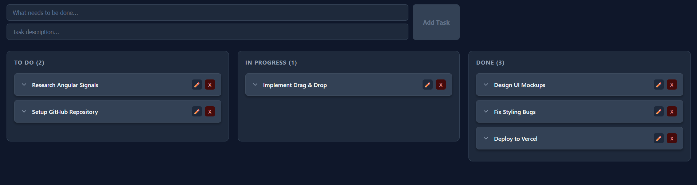

# 🚀 TaskFlow - Modern Angular Kanban Board


A reactive, responsive, and fully functional Kanban Task Manager built with the latest features of **Angular 18+**. The application focuses on modern state management using **Signals** and efficient DOM updates with the new **Control Flow** syntax.

👉 **[Live Demo Available Here]()**



## ✨ Key Features

* **Drag & Drop Interface:** Smooth task management across columns using **Angular CDK**.
* **Reactive State Management:** Powered entirely by **Angular Signals**.
* **Data Persistence:** Tasks are saved to `localStorage` (with SSR-safe implementation).
* **CRUD Operations:** Create, Read, Update, and Delete tasks with validation.
* **Modern UI/UX:**
    * Responsive Dark Mode design.
    * Custom Modals for confirmations and editing.
    * Keyboard accessibility (Enter to add tasks).
* **Optimized Performance:** Uses Angular's new `@for` and `@if` control flow syntax.

## 🛠️ Technical Stack & Concepts

This project was built to demonstrate proficiency in modern Angular development practices:

* **Framework:** Angular 18+ (Standalone Components API).
* **State Management:** Signals (`signal`, `computed`, `update`).
* **Drag & Drop:** `@angular/cdk/drag-drop`.
* **Forms:** Reactive Forms with typed controls.
* **Styling:** SCSS with BEM-like naming and CSS variables.
* **Architecture:**
    * **Smart Component:** `AppComponent` handles logic and state.
    * **Dumb Component:** `TaskCardComponent` handles presentation and emits events (`output()`, `input()`).

## ⚙️ Installation & Running

1.  **Clone the repository:**
    ```bash
    git clone
    ```

2.  **Install dependencies:**
    ```bash
    npm install
    ```

3.  **Start the development server:**
    ```bash
    npm start
    ```

4.  **Open in browser:**
    Navigate to `http://localhost:4200/`.